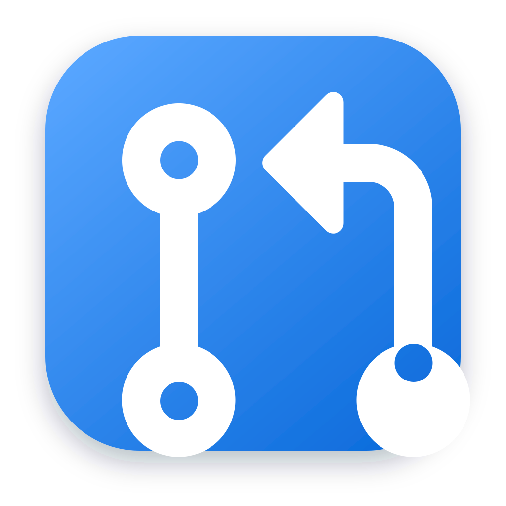

<p align="center">
  
</p>

<h1 align="center">Glance</h1>

<p align="center">
  A native macOS pull-request HUD for the work that needs your attention.
</p>

Glance keeps your GitHub pull requests one click away in the menu bar. Open its compact popover for a quick check, or detach it into an always-on-top panel while you work.

## What Glance does

- Shows review requests, pull requests you opened, and any other sections you define with GitHub search queries.
- Surfaces draft, review, required-check, and stacked-pull-request status without opening a browser.
- Displays an attention count directly in the menu bar.
- Notifies you when a new review request arrives.
- Lets you choose which repositories appear in the app and can generate notifications.
- Keeps the last successful results visible when GitHub is temporarily unavailable.
- Opens at login and refreshes automatically on your preferred schedule.

Command-click a pull request to dismiss its current revision. If a new commit is pushed, the pull request returns automatically.

## Install

Glance requires macOS 14 or later and an authenticated installation of [GitHub CLI](https://cli.github.com/).

1. Install GitHub CLI if needed:

   ```sh
   brew install gh
   ```

2. Connect it to GitHub:

   ```sh
   gh auth login
   ```

3. [Download the latest Glance DMG](https://github.com/atchad/glance/releases/latest/download/Glance.dmg), open it, and drag Glance into Applications.
4. Launch Glance. Its pull-request count will appear in the menu bar.

Glance releases are universal for Apple silicon and Intel Macs, signed with a Developer ID certificate, and notarized by Apple.

> [!NOTE]
> Glance is currently a preview. GitHub CLI provides authentication for now; a future general-distribution build should use a GitHub App and browser-based sign-in.

## Make it yours

Glance starts with sections for pull requests requesting your review and pull requests you opened. In Settings, you can:

- Add, rename, reorder, or remove sections backed by validated GitHub pull-request searches.
- Include or exclude repositories with search and bulk selection.
- Choose which pull requests contribute to the menu-bar count.
- Control notifications, refresh frequency, launch behavior, and panel behavior.
- Adjust row details, status presentation, and completed-review filtering.

Click a pull request to open it on GitHub. Its context menu can also copy the URL or branch name.

## Privacy and local data

Glance asks GitHub CLI for your existing token when it refreshes and does not persist that token itself. Pull-request metadata and preferences are stored locally in:

```text
~/Library/Application Support/Glance
```

Excluding a repository removes its pull requests from the live queue and local cache and prevents new-review notifications from that repository.

## Build from source

Building Glance requires macOS 14 or later and Xcode 16 or later.

```sh
git clone git@github.com:atchad/glance.git
cd glance
swift run Glance
```

Run the test suite with:

```sh
swift test
```

Create a standalone application bundle or DMG with:

```sh
./scripts/build-app.sh
./scripts/build-dmg.sh
```

Without a Developer ID certificate in your Keychain, local artifacts receive an ad-hoc signature. Maintainer signing, notarization, and tagged-release instructions are documented in [docs/RELEASING.md](docs/RELEASING.md).

## Acknowledgments

GitHub interface glyphs are from [Primer Octicons](https://github.com/primer/octicons) and are distributed under the MIT License. The packaged license is included in [`Sources/Glance/Resources/Octicons/LICENSE`](Sources/Glance/Resources/Octicons/LICENSE).
