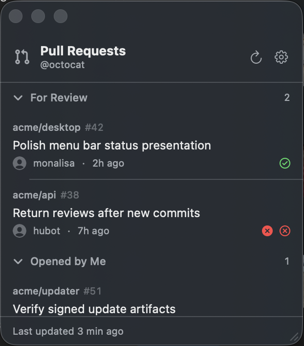

<p align="center">
  
</p>

<h1 align="center">Glance</h1>

<p align="center">
  A native macOS pull-request HUD for the work that needs your attention.
</p>

Glance keeps your GitHub pull requests one click away in the menu bar. Open its compact popover for a quick check, or detach it into an always-on-top panel while you work.

<p align="center">
  
</p>

## What Glance does

- Shows review requests, pull requests you opened, and any other sections you define with GitHub search queries.
- Explains why a pull request needs attention, including review requests, new commits, failed
  checks, unresolved conversations, merge conflicts, and merge readiness.
- Surfaces draft, review, aggregate check, merge-queue, auto-merge, and stacked-pull-request status
  without opening a browser.
- Displays an attention count directly in the menu bar.
- Notifies you when a new review request arrives.
- Can notify you when reviews, checks, merge readiness, or merge-queue state changes.
- Lets you pin important pull requests or snooze them until later, until checks finish, or until the pull request changes.
- Read the full title and fetched check details using a row’s info button or I on the selected row. Copy title preserves the exact title. Check details identify cached data and may omit checks that exist on GitHub.
- Supports local search, keyboard triage, and an optional system-wide shortcut for the panel. J/K or arrows traverse expanded search results; Return opens, D dismisses, and P toggles a pin on the selected row. Duplicate PRs are visited in section order. Hiding a selected row clears selection. Slash focuses search, where normal text editing takes precedence.
- Lets you choose which repositories appear in the app and can generate notifications.
- Keeps the last successful results visible when GitHub is temporarily unavailable.
- Opens at login and refreshes automatically on your preferred schedule.
- Checks for new Glance releases and can install them automatically.

Command-click a pull request to dismiss its current revision. If a new commit is pushed, the pull request returns automatically. Use a row's context menu to pin it or snooze it.

With the panel focused, use the arrow keys or J/K to move between pull requests, Return to open the selected pull request, D to dismiss it, P to pin it, R to refresh, and / to search.

## Install

Glance requires macOS 14 or later and an authenticated installation of [GitHub CLI](https://cli.github.com/).

1. Install GitHub CLI if needed:

   ```sh
   brew install gh
   ```

2. Connect it to GitHub:

   ```sh
   gh auth login --hostname github.com
   ```

3. [Download the latest Glance DMG](https://github.com/atchad/glance/releases/latest/download/Glance.dmg), open it, and drag Glance into Applications.
4. Launch Glance. Its pull-request count will appear in the menu bar.

Glance currently connects to github.com using the account selected by GitHub CLI for that host. If the wrong account appears, use `gh auth status --hostname github.com` and `gh auth switch --hostname github.com --user YOUR_USERNAME`, then refresh Glance. If authentication has expired, run `gh auth login --hostname github.com` again. Do not paste tokens into Glance or troubleshooting reports.

Glance releases are universal for Apple silicon and Intel Macs, signed with a Developer ID certificate, and notarized by Apple.

## Make it yours

Glance labels a review request as yours when GitHub names your account directly or confirms your membership in the requested team (including child teams). Unavailable membership or incomplete request data is treated as unknown. Review-request dates come only from matching personal or team events; an unavailable date falls back to the PR creation date in the row.

Dismissed reviews do not count as your approval, so they remain visible under the default approval filter when returned by a section’s query. Their review date and commit still support personal re-request and new-commit attention. The optional filter for approvals from other reviewers still applies independently. Older cached approvals remain unchanged until fresh GitHub data replaces them; previously hidden PRs require a successful refresh to return.

Glance starts with sections for pull requests requesting your review and pull requests you opened. In Settings, you can:

- Add, rename, reorder, or remove sections backed by validated GitHub pull-request searches. The Add section Examples menu fills editable drafts for assigned PRs, your non-draft PRs, or a repository. Replace the repository template, validate, then add; visibility preferences still apply.
- Include or exclude repositories with search and bulk selection.
- Choose which pull requests contribute to the menu-bar count, including whether review requests
  also count pull requests you opened.
- Sort each section by attention, review-request time, recent activity, repository, or stack order.
- Control notifications, refresh frequency, launch behavior, and panel behavior.
- Choose which pull-request transitions generate notifications and configure a global panel shortcut.
- Adjust row details, including optional additions and deletions, status presentation, and
  completed-review filtering.

Click a pull request to open it on GitHub. Its context menu can also copy the URL or branch name.

## Privacy and local data

Glance asks GitHub CLI for your existing token when it refreshes and does not persist that token itself. Pull-request metadata and preferences are stored locally in:

```text
~/Library/Application Support/Glance
```

Excluding a repository removes its pull requests from the live queue and local cache and prevents new notifications from that repository. This filters the active app data; it does not erase recovery copies, external backups, previously delivered notifications, or matching text in saved queries and preferences.

Missing local files are normal on first launch. If existing files are damaged or contain invalid values, Glance preserves a recovery copy beside them when possible and shows a warning. If it cannot preserve the original, it disables writes to that file. Save failures are also shown; do not assume recent changes survived quitting while a save-error warning remains. Recovery copies can contain private PR metadata.

Approved PRs hidden by your filters are omitted from the offline cache unless pinned. After a restart, making those filters less restrictive may require a successful refresh to bring the PRs back. A pin does not override a repository exclusion.

Check icons summarize GitHub's aggregate rollup. Glance does not offer a complete check-detail viewer; open the PR on GitHub for individual logs and the full list. When fetched detail is incomplete, attention text avoids an exact failing-check count.

## Build from source

Building Glance requires macOS 14 or later and Xcode 16 or later.

```sh
git clone https://github.com/atchad/glance.git
cd glance
./scripts/build-app.sh
open dist/Glance.app
```

Run the test suite with:

```sh
swift test
```

Create a standalone application bundle or DMG with:

```sh
./scripts/build-app.sh
./scripts/build-dmg.sh --use-existing-app
./scripts/build-pkg.sh --use-existing-app
```

Without a Developer ID certificate in your Keychain, local artifacts receive an ad-hoc signature. Maintainer signing, notarization, and tagged-release instructions are documented in [docs/RELEASING.md](docs/RELEASING.md).

## Contributing

Contributions are welcome. See [CONTRIBUTING.md](CONTRIBUTING.md) for development checks and pull-request guidance. Report suspected vulnerabilities through the private channel described in [SECURITY.md](SECURITY.md).

## Acknowledgments

GitHub interface glyphs are from [Primer Octicons](https://github.com/primer/octicons) and are distributed under the MIT License. The packaged license is included in [`Sources/Glance/Resources/Octicons/LICENSE`](Sources/Glance/Resources/Octicons/LICENSE).

Glance itself is available under the [MIT License](LICENSE).

Automatic updates use [Sparkle](https://sparkle-project.org/), distributed under its included license at `Glance.app/Contents/Resources/Sparkle-LICENSE.txt`.
